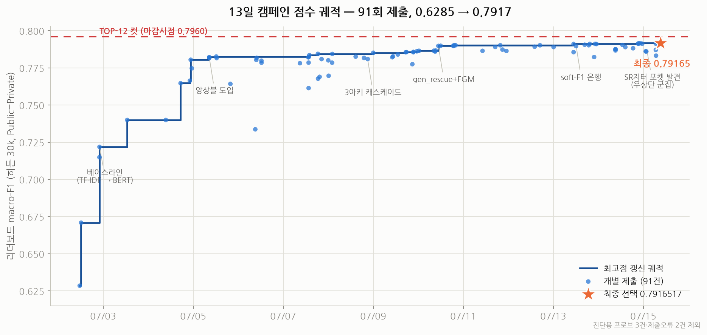
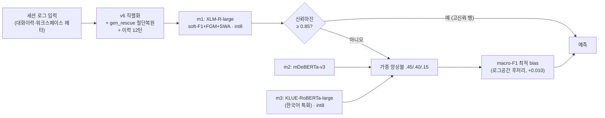
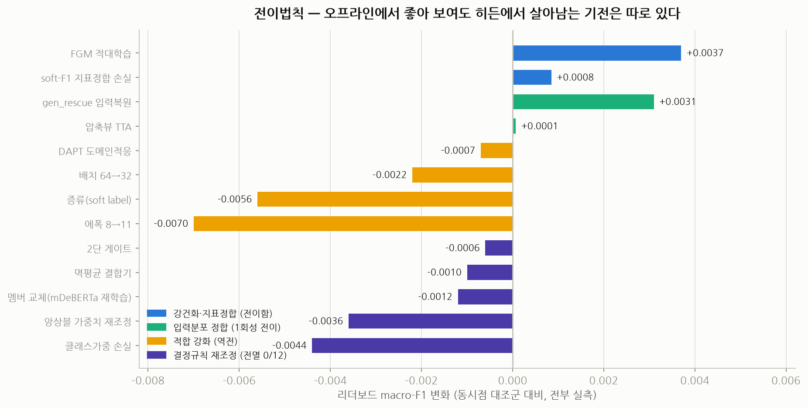
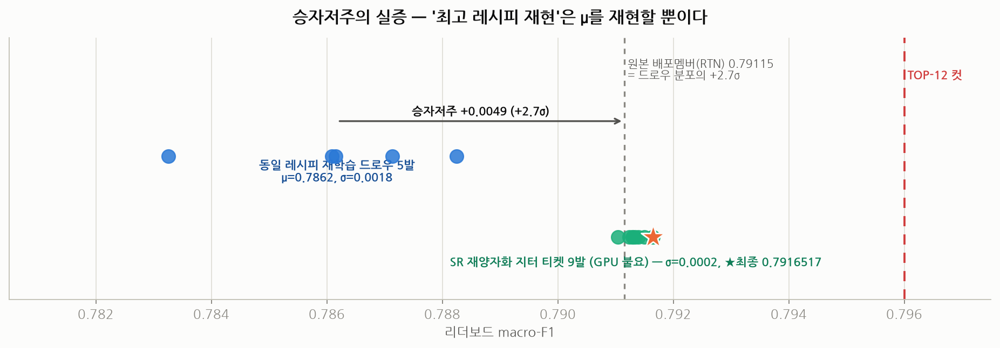

# AI 에이전트 행동 예측 — 13일간의 리더보드 캠페인

> **Dacon 대회**: 코딩 에이전트 세션 로그로부터 다음 행동(14클래스) 예측 · 지표 **macro-F1** · 히든 테스트 30k (Public=Private)
> **제약**: 제출물 = 코드+모델 zip ≤ 1GB · T4 1장 오프라인 추론 600초 이내
> **결과**: **0.6285 → 0.7916517** (91회 제출, 13일) · 1위 0.7998 · TOP-12 컷 0.7960



이 레포는 단순한 모델 코드가 아니라, **91번의 제출을 하나의 실험 캠페인으로 운영한 기록**입니다.
모든 아이디어는 리더보드 실측으로 판정했고, 그 판정 로그 전체가 [`experiments_master.csv`](experiments_master.csv)에 남아 있습니다.

---

## 1. 시스템 아키텍처

1GB·600초 제약 안에서 성능을 최대화하기 위해 **3아키텍처 캐스케이드 앙상블 + int8 양자화 배포**를 설계했습니다.



- **양자화**: 대형 멤버 2개를 group-64 per-row **int8**로 압축해 3멤버를 921MB에 적재 (파리티 손실 ≈ 0)
- **직렬화 수리(gen_rescue)**: 토큰 절단으로 소실되는 구조 헤더를 복원 — 단일 레버 기준 **+0.0031**
- **학습 레시피**: soft-F1 서로게이트 손실(지표정합, w=0.5) + FGM 적대학습 + SWA — 셋 다 리더보드 실측 양전

## 2. 이 캠페인이 실측으로 증명한 것들

### 2-1. 전이법칙 — "오프라인에서 좋아 보여도, 히든에서 살아남는 기전은 따로 있다"

교차검증 +0.005짜리 아이디어가 리더보드에서 음전하는 일이 반복되자, **모든 개입을 기전 클래스로 분류하고 클래스별 전이 여부를 실측**했습니다.



- **강건화·지표정합**(FGM, soft-F1)만이 안정적으로 전이
- **입력분포 정합**(gen_rescue)은 크게 전이하지만 1회성 — 같은 축의 두 번째 개선은 +0.0001 미만
- **적합 강화**(에폭↑, 증류, 배치변경)는 전부 역전 — in-dist 과적합이 OOD를 훼손
- **결정규칙 재조정**(앙상블 가중치·게이트·결합기·bias 재적합)은 **12전 12패** — 홀드아웃 튜닝은 히든에 전이하지 않는다

### 2-2. 승자저주 — "최고 레시피 재현은 μ를 재현할 뿐이다"

배포 멤버(0.79115)와 같은 레시피·다른 시드로 5번 재학습한 결과, 평균은 **0.7862**였습니다.
즉 배포 멤버는 실력이 아니라 **+2.7σ의 행운 추첨**이었고, 이를 종반에야 알게 되어 GPU 슬롯을 낭비했습니다.
→ 교훈: **캠페인 초반에 시드 분산(σ)부터 측정하라.**



### 2-3. SR 재양자화 지터 — GPU 없이 점수를 재추첨하는 발견

마지막 밤의 발견: int8 양자화(결정론적 반올림, RTN)는 하나의 "실현"일 뿐이므로,
fp16 원본을 **확률적 반올림(SR, 비편향)** 으로 재양자화하면 가중치의 25%가 ±1LSB 플립되어
**기대성능이 같은 새로운 티켓**이 나옵니다. 9발 발사 결과 σ≈0.0002의 안정적 포켓을 형성했고,
원본 RTN이 저추첨이었던 만큼을 회수해 **최종 +0.0005**를 확보했습니다.
마지막 제출은 "검증된 행운의 m1은 고정, m3만 재추첨" 설계로 **~50% 확률 베팅을 적중**시키며 캠페인 최고점(0.7916517)으로 마무리했습니다.

## 3. 운영 — AI 에이전트 함대와 사전등록 규율

이 캠페인은 **Claude Code(멀티에이전트 워크플로우) + GPT 계열(codex) 교차검증**으로 운영됐습니다.

- **매 판독마다** 다관점 패널(법의학/재계획/반증사냥)이 결과를 해석하고, 서로 다른 모델 계열이 상호 비판해 수렴
- **사전등록**: 점수가 나오기 전에 분기표("X 이상이면 A, 이하면 B")·게이트 조건·버림서열을 등록 — 충격적인 판독(서로 다른 두 모델이 0.00006차 동률로 폭락)에도 감정적 이탈 없이 기계적으로 대응
- **위기 프로토콜 실전 사례**: 동률 쇼크 → ①무결성 즉석검사 → ②500행 라벨 프로브(버그 vs 품질 분리) → ③단일변수 분리실험 → ④가설 4개에 사전확률·업데이트 규칙 등록 → 6시간 만에 원인 확정(분포 진실)
- **밤샘 무인 운영**: PID 기반 학습감시·드라이버 붕괴 감지·자동 조립 파이프라인으로 GPU 2장을 13일간 유휴 없이 가동. 실사고 6건(이중발사·NVML 붕괴·큐 오발사·zip 레이스 등)을 전부 실시간 수습

제출 파이프라인에는 실사고에서 배운 **6종 안전가드**(자기파괴 방지·캐시 신선도·메타 assert·byte-diff·용량·5행 런타임 캐너리)가 내장되어 있습니다.

## 4. 레포 맵

```
├── README.md                      ← 이 문서
├── experiments_master.csv         ← 91회 제출 전체의 실측·판정 원장 (단일 진실원천)
├── assets/                        ← 차트
├── common/                        ← 직렬화·앙상블 서빙·후처리·양자화 라이브러리
│   ├── ad_lib.py                  ← 캐스케이드 서빙 코어 (마진게이트·멤버별 이력턴·dequant)
│   └── serialize.py, postproc.py, vocab_prune.py, ...
├── action_decision_maximum/src/   ← 학습 CLI (soft-F1·FGM·SWA·LLRD·gen_rescue, env로 전 옵션 제어)
├── sim/                           ← 실험·분석 스크립트 (조립 파이프라인, SR지터 양자화, 프로브, 게이트)
│   └── ops/                       ← 야간 학습 체인·발사 스크립트
├── eda/                           ← 오류분석·베이즈플로어·라벨시프트 등 EDA
├── docs/
│   ├── RETROSPECTIVE_SKILLS_2026-07-15.md  ← 회고: 방법론·하네스·교훈 총정리
│   └── archive/                   ← 캠페인 당시 작전문서·레드팀 보고서 원본
└── .claude/skills/                ← 이 캠페인에서 추출한 재사용 Claude 스킬 7종
```

> 대회 데이터(`data/`)와 모델 가중치는 레포에 포함되지 않습니다 (Dacon 규정). 학습 재현은 `action_decision_maximum/src/train_full_cli.py`의 env 옵션 참조.

## 5. 재사용 자산 — Claude 스킬 7종

캠페인에서 검증된 절차를 다음 프로젝트에서 바로 쓸 수 있는 Claude Code 스킬로 추출했습니다 ([.claude/skills/](.claude/skills/)):

| 스킬 | 요약 |
|---|---|
| `seed-sigma-first` | 캠페인 초반 σ·재현노이즈·승자저주 측정 프로토콜 |
| `ml-transfer-audit` | 기전 클래스 기반 오프라인→실전 전이 감사 (SUBMIT/HOLD/DEAD) |
| `submission-guards` | 제출물 조립 6종 안전가드 + 런타임 캐너리 |
| `train-fleet-watch` | 장시간 GPU 학습 감시·함대 운영 수칙 |
| `readout-protocol` | 판독 표준 프로토콜 + 충격판독 위기대응 5단계 |
| `quant-jitter-tickets` | SR 재양자화 재추첨 기법 (구현 코드 포함) |
| `endgame-slots` | 마감일 슬롯 경제학 + 최종선택 불변식 |

## 6. 회고

TOP-12에는 0.0044가 모자랐습니다. 결정적이었던 것은 기술이 아니라 **순서**였습니다 — 시드 분산을 마지막 날 밤에야 측정했고, 그때 이미 최고 점수가 +2.7σ 행운이라는 사실이 드러났습니다. 처음 이틀 안에 그 측정을 했다면 캠페인 후반의 슬롯 배분 전체가 달라졌을 것입니다.

대신 이 캠페인은 **"측정이 전략을 이긴다"** 는 것을 91번의 실측으로 배우는 과정이었고, 그 배움 전부가 이 레포의 원장·회고·스킬로 남아 있습니다. 상세한 기술 회고는 [docs/RETROSPECTIVE_SKILLS_2026-07-15.md](docs/RETROSPECTIVE_SKILLS_2026-07-15.md)를 참고하세요.

---

**Tech**: Python · PyTorch · HuggingFace Transformers · XLM-RoBERTa-large / mDeBERTa-v3 / KLUE-RoBERTa · int8 quantization · soft-F1 surrogate loss · FGM · SWA · Claude Code multi-agent orchestration
