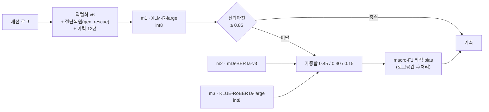

# 2026 AI·SW중심대학 디지털 경진대회 : AI부문
https://dacon.io/competitions/official/236694/overview/description


코딩 에이전트의 세션 로그(대화 이력 + 워크스페이스 메타데이터)로부터 에이전트가 취할 다음 행동(14클래스)을 예측하는 대회. 2026-07-02 ~ 07-15, 13일간 91회 제출로 수행한 실험 캠페인의 전체 기록이다.

| 항목 | 내용 |
|---|---|
| 과제 | 14클래스 분류, 평가지표 macro-F1 |
| 테스트 | 히든 30,000행, Public = Private (셰이크업 없음) |
| 제출 제약 | 코드+모델 zip ≤ 1GB, T4 1장 오프라인 추론 ≤ 600초 |
| 최종 점수 | **0.79165** (시작 베이스라인 0.62852) |
| 상위 기록 | 1위 0.79878 · 12위(수상권) 0.79600 |


전 제출의 점수·구성·판정은 [`experiments_master.csv`](experiments_master.csv)에 기록되어 있다.

---

## 1. 최종 시스템

1GB / 600초 제약 하에서 3개 아키텍처를 int8 양자화로 적재하고, 신뢰도 기반 캐스케이드로 추론 시간을 절약하는 구조.



구성 요소별 리더보드 기여 (전부 단독 실측):

| 요소 | 내용 | LB 기여 |
|---|---|---|
| gen_rescue | 토큰 절단으로 소실되는 구조 헤더의 복원 (70k 중 28k행 해당) | +0.0031 |
| FGM | 임베딩 적대교란 학습 | +0.0037 |
| soft-F1 손실 | macro-F1 서로게이트를 CE에 w=0.5 가산 (지표정합) | +0.0009 |
| macro-F1 bias | 클래스별 로그공간 편향 후처리 | +0.0103 |
| int8 양자화 | group-64 per-row, 대형 멤버 2개 압축 → 3멤버 921MB | 손실 ≈ 0 |
| SR 재양자화 | 아래 2-3절 | +0.0005 |

## 2. 91회 제출이 남긴 실측 결론

### 2-1. 오프라인 개선의 리더보드 전이는 기전 클래스가 결정한다

교차검증에서 +0.005급이던 아이디어가 리더보드에서 음전하는 일이 반복되어, 모든 개입을 기전별로 분류하고 전이 여부를 실측했다.


- 강건화·지표정합(FGM, soft-F1): 전이함
- 입력분포 정합(gen_rescue): 크게 전이하나 1회성 — 같은 축의 후속 개선은 +0.0001 미만
- 적합 강화(에폭 증가, 증류, 배치 변경): 전부 역전
- 결정규칙 재조정(앙상블 가중치·게이트·결합기·bias 재적합): **12전 12패**

### 2-2. 최고점은 실력이 아니라 추첨의 상위 실현일 수 있다 (승자저주)

배포 멤버(0.79115)와 동일 레시피·다른 시드로 5회 재학습한 결과 평균 0.7862, 표준편차 0.0018. 배포 멤버는 분포의 +2.7σ 지점이었다. 부수 실측: 학습 데이터로 계산한 in-dist 점수는 히든 점수와 순위가 역전됨(로컬 최고 멤버가 리더보드 최저) — in-dist 평가는 버그 판별용이지 후보 선별용이 아니다.


### 2-3. int8 양자화는 하나의 "실현"이다 — SR 재양자화

결정론적 반올림(RTN) 양자화 대신 fp16 원본에 확률적 반올림(SR, 비편향)을 적용하면 가중치의 25%가 ±1LSB 플립되어 기대성능이 같은 새 모델이 나온다. GPU 없이 9회 재추첨한 결과 σ≈0.0002의 안정 분포를 확인했고, 원본 RTN이 저추첨이었던 만큼(+0.0005)을 회수했다. 최종 제출은 이 분포에서 검증된 m1을 고정하고 m3만 재추첨하는 구성이며, 캠페인 최고점(0.79165)이 되었다.

## 3. 운영 방식

- **실험 원장**: 모든 판독·판정·사고를 단일 CSV에 기록. 폐기된 접근의 재시도를 원장 대조로 차단
- **사전등록**: 점수 도착 전에 분기표(임계값별 행동)·게이트 조건·슬롯 버림서열을 문서로 고정. 예상 밖 판독에서도 등록된 분기를 그대로 실행
- **위기 프로토콜**: 이상 판독 시 ①제출물 무결성 검사 → ②소형 라벨 프로브로 버그/품질 분리 → ③단일변수 분리실험 → ④가설별 사전확률과 업데이트 규칙 등록 순서로 수사. 실전 1회 적용(서로 다른 두 모델의 0.00006차 동률 폭락 → 6시간 내 원인 확정)
- **멀티에이전트**: Claude Code 워크플로우(다관점 패널)와 GPT 계열 CLI(codex)의 독립 판정을 상호 비판시켜 수렴. 서로 다른 오류가 교차검증에서 검출됨
- **무인 GPU 운영**: PID 기반 학습 감시(완주/사망/정지/드라이버 붕괴), 마감 역산 에폭 자동룰, 발사 후 생존확인. 13일간 GPU 2장 상시 가동, 인프라 사고 6건(프로세스 이중발사, NVML 붕괴 3회, 큐 오발사, zip 쓰기 레이스) 실시간 수습
- **제출 안전가드 6종**: 자기파괴 방지 / 캐시 신선도 / 메타 assert / byte-diff / 용량 / 실제 zip을 풀어 끝까지 실행하는 런타임 캐너리 — 전부 실사고 후 도입

## 4. 기술 스택

| 분류 | 사용 기술 |
|---|---|
| 언어·환경 | Python 3.11 · CUDA 12.8 · 학습 A6000 48GB(Docker) · 추론 타깃 T4 16GB(오프라인, fp16) |
| 모델 | XLM-RoBERTa-large · mDeBERTa-v3-base · KLUE-RoBERTa-large |
| 프레임워크 | PyTorch `2.7.1` · HuggingFace Transformers `4.46.3` · scikit-learn `1.8.0` · NumPy `1.26` |
| 학습 기법 | soft-F1 surrogate loss · FGM adversarial training · SWA · LLRD · gradient checkpointing |
| 경량화·서빙 | int8 group-wise 양자화(자체 구현) · vocab pruning · 마진 게이트 캐스케이드 · 로그공간 bias 후처리 |
| 실험 인프라 | bash 조립 파이프라인(가드 6종) · 런타임 캐너리 · 라벨 프로브 하네스 · paired bootstrap 검정 |
| 운영 | Claude Code 멀티에이전트 워크플로우 · codex CLI 교차검증 · PID 기반 GPU 감시 · 실험 원장(CSV) |

## 5. 저장소 구조

```
├── README.md
├── experiments_master.csv           # 실험 원장 — 전 제출의 실측·판정 기록
├── assets/                          # 차트 3장
├── common/                          # 서빙 라이브러리 (직렬화·캐스케이드·양자화 복원·후처리)
├── action_decision_maximum/
│   ├── src/train_full_cli.py        # 학습 CLI (전 옵션 env 제어)
│   └── submission/script.py         # 제출물 추론 진입점
├── sim/                             # 제출물 조립 파이프라인 · SR 재양자화
│   └── ops/                         # GPU 발사 스크립트 (에폭 자동룰 내장)
├── eda/                             # 오류분석 · 라벨충돌(Bayes floor) 분석
├── splits/                          # 고정 fold 인덱스
├── docs/
│   ├── RETROSPECTIVE_SKILLS_2026-07-15.md   # 기술 회고 (방법론·하네스·교훈)
│   ├── SKILLS_AND_HARNESS.md            # 클로드 스킬 7종 + 하네스 8종 카탈로그
│   └── archive/                     # 캠페인 당시 원본 문서 (종합보고서 · 운영문서 · 사전등록 실물)
└── .claude/skills/                  # 캠페인에서 추출한 재사용 Claude Code 스킬 7종
```

대회 데이터와 모델 가중치는 규정상 포함하지 않는다.

## 6. 회고 요약

수상권(TOP-12)에는 0.0044가 부족했다. 기술적 병목보다 측정의 순서가 결정적이었다 — 시드 분산과 승자저주를 캠페인 마지막 날에 측정했고, 이를 초반에 했다면 후반의 GPU·제출 슬롯 배분이 달라졌을 것이다. 이 결론을 포함한 전체 기술 회고는 [docs/RETROSPECTIVE_SKILLS_2026-07-15.md](docs/RETROSPECTIVE_SKILLS_2026-07-15.md), 검증된 절차의 스킬화는 [.claude/skills/](.claude/skills/)에 있다.
